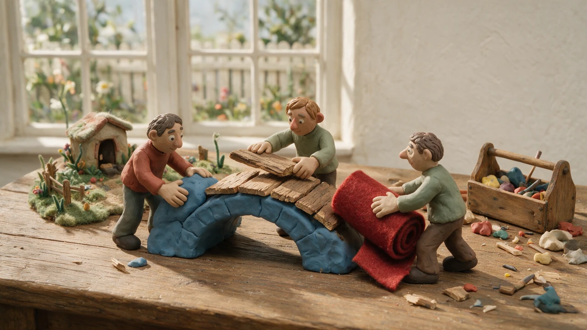
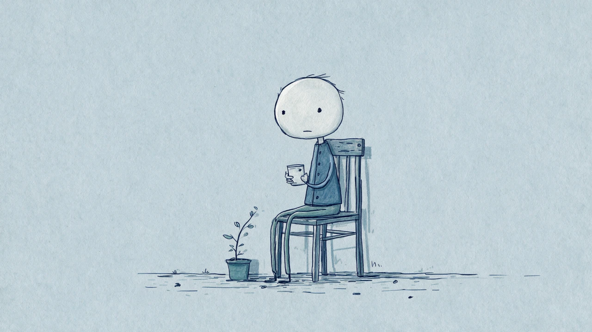
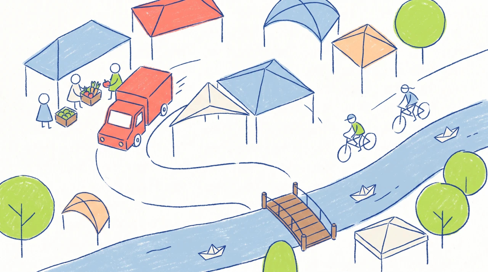

<h1 align="center">Animated Voiceover</h1>

  <strong>English</strong> · <a href="./README_CN.md">简体中文</a>

  <strong>Turn ideas worth understanding into AI-animated videos worth watching.</strong>

  An open-source creative Skill for Agents, covering topic research, narration writing, visual design, multi-shot direction, voice consistency, and final video production.

  
  
  
  
  

  <a href="#what-it-can-do-for-you">Core Capabilities</a> ·
  <a href="#video-examples">Examples</a> ·
  <a href="#built-in-visual-styles">Visual Styles</a> ·
  <a href="#installation">Installation</a> ·
  <a href="#start-with-a-single-sentence">Get Started</a>

`animated-voiceover` is designed for knowledge-driven content across philosophy, psychology, history, economics, finance, technology, and related fields. Start with a topic, and it will work with you to turn a rough idea into a complete narration script, then carry it forward into a visual style, character references, multi-shot video prompts, a consistent voice, and a production-ready plan.

It does more than “write a few prompts.” It addresses the three hardest problems in animated knowledge videos: **explaining complex ideas clearly, making abstract concepts visually compelling, and keeping multiple AI-generated clips consistent enough to feel like one film.**

## What It Can Do for You

- **Make complex ideas easy to follow.** From topic research and editorial decisions to narration structure, it helps you build a story your audience can understand and wants to keep watching.
- **Turn abstract ideas into concrete scenes.** Instead of relying on floating symbols or empty visual metaphors, it uses characters, actions, settings, and consequences to make philosophy and knowledge actually happen on screen.
- **Turn a script into a production-ready animation plan.** It breaks the narrative into balanced segments, directs multiple shots for each one, and produces video prompts ready for Seedance.
- **Keep the entire video consistent.** Visual references, character references, and voice anchors reduce character drift, style shifts, and voice inconsistency across clips.
- **Go from idea to finished video.** Beyond writing, it can continue through reference planning, clip generation, task tracking, video assembly, and title-card cover design.

## Video Examples

<table>
  <tr>
    <td width="50%">
      
    </td>
    <td width="50%">
      
    </td>
  </tr>
  <tr>
    <td align="center"><b>Philosophy</b> — bringing ideas into characters and stories</td>
    <td align="center"><b>Psychology</b> — explaining abstract concepts through concrete events</td>
  </tr>
</table>

## Built-in Visual Styles

The Skill includes six carefully developed visual languages, ranging from cinematic 3D to hand-drawn crayon animation. Each style defines more than what the image should look like: it also provides creative direction for character design, materials, color, camera movement, and animation rhythm.

These styles are starting points, not templates. The Skill redesigns the setting, characters, and shots around each new topic. You can also provide your own style description or reference image to create an entirely different visual direction.

<table>
  <tr>
    <td width="50%" align="center">
       
      <b>Cinematic 3D Animation</b> 
      Painterly surfaces, restrained color, and story-rich cinematic lighting 
      <a href="./styles/cinematic-3d-animation.md">View style guide</a>
    </td>
    <td width="50%" align="center">
       
      <b>Clay Stop-Motion</b> 
      Handmade clay figures, miniature sets, and tactile frame-by-frame motion 
      <a href="./styles/clay-stop-motion.md">View style guide</a>
    </td>
  </tr>
  <tr>
    <td width="50%" align="center">
       
      <b>Melancholic Blue Line Animation</b> 
      Cool blue-gray paper, awkward pencil lines, and a quiet introspective mood 
      <a href="./styles/melancholic-blue-simple-line-animation.md">View style guide</a>
    </td>
    <td width="50%" align="center">
       
      <b>Soft Colored-Pencil Animation</b> 
      Gentle outlines, warm paper texture, and an approachable playful tone 
      <a href="./styles/soft-colored-pencil-cute-animation.md">View style guide</a>
    </td>
  </tr>
  <tr>
    <td width="50%" align="center">
       
      <b>Clean-Line Crayon Animation</b> 
      Bright color blocks, clear hand-drawn lines, and an orderly 2D world 
      <a href="./styles/clean-line-crayon-animation.md">View style guide</a>
    </td>
    <td width="50%" align="center">
       
      <b>Dopamine Cute 3D Animation</b> 
      Bouncy characters, vibrant colors, and energetic layered compositions 
      <a href="./styles/dopamine-cute-3d-animation.md">View style guide</a>
    </td>
  </tr>
</table>

## More Than a Look: Reusable Voices and Reference Assets

Alongside the six visual styles, the Skill includes curated image references and multiple standardized Chinese voices: a calm young male voice, a bright and energetic male voice, a warm adult female voice, and a lively young female voice.

You can use these assets to establish a consistent identity quickly, or create a dedicated voice for the current production from the first clip. The Skill asks you to make the choice—it never silently decides the style or voice for you.

See the complete [built-in reference asset library](./references/reference-asset-library.md).

## A Complete Workflow Designed for Animated Knowledge Videos

1. **Decide what to say.** Research the topic around your audience and target duration, then write a clear, well-structured narration script.
2. **Decide how it should look.** Choose a built-in style, a custom style, or a reference image to establish a consistent visual direction and character identity.
3. **Direct the words into scenes.** Break the script into balanced segments and design concrete events, multi-shot direction, and generation-ready prompts for each one.
4. **Validate before scaling.** Produce the first clip, confirm the visual and vocal direction, then lock the voice and reference assets before generating the rest.
5. **Assemble the complete film.** Bring every clip together in sequence, and create a title-card cover when the video needs publishing artwork.

The production rhythm validated so far breaks a 1–5 minute video into 15-second clips, with roughly 60 Chinese characters of narration and about five shots per clip. These numbers serve the content rather than constrain it.

## Installation

Clone or copy this repository into a skills directory your Agent can access.

If you use Codex, you can also tell it directly:

> Install the `$animated-voiceover` skill from `https://github.com/s1dashu/animated-voiceover`.

## Start with a Single Sentence

Once installed, you can begin with a request like this:

> Use the `animated-voiceover` Skill to create a two-minute animated explainer: “Stoicism in Two Minutes.”

Or include more creative direction:

> Use the `animated-voiceover` Skill to turn “Why do people procrastinate?” into a 90-second psychology explainer. Use a gentle tone and a hand-drawn style, and confirm the script and visual direction with me first.

The Skill will guide you through the necessary choices. You do not need to understand Seedance prompting, voice anchors, or multimodal asset connections in advance.

## Tools and Scope

The officially maintained and production-tested media execution path currently uses [LibTV CLI](https://libtv.ai/). The underlying methods for narration structure, visual consistency, character references, multi-shot direction, and voice management are not tied to a single platform. After reviewing the latest official documentation for the target platform, they can also be adapted to Higgsfield, Jimeng, and other multimodal generation CLIs.

The current workflow is designed primarily for 1–5 minute videos assembled from multiple 15-second clips. Seedance 2.5 Pro's 30-second clips have not yet been systematically validated, so they are not presented as a default capability of this release.

For the full execution rules, read [SKILL.md](./SKILL.md). The methods for narration, video prompts, voice references, and cover production are organized under [`references/`](./references/).

## License

Original content in this repository is released under the [MIT License](./LICENSE). Third-party documentation and externally linked content remain subject to their respective licenses and rights.

  <strong>If you want to make knowledge more watchable too, try it, share it, and give the project a Star.</strong>

