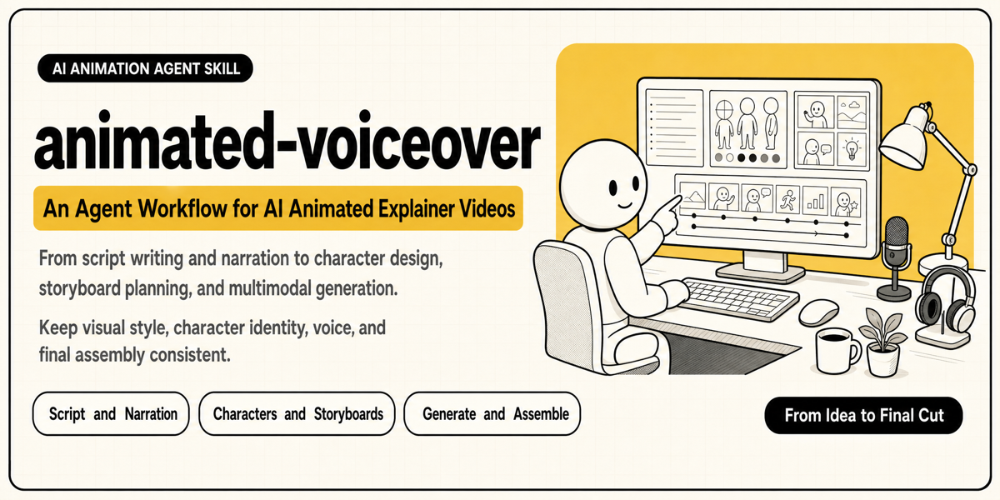
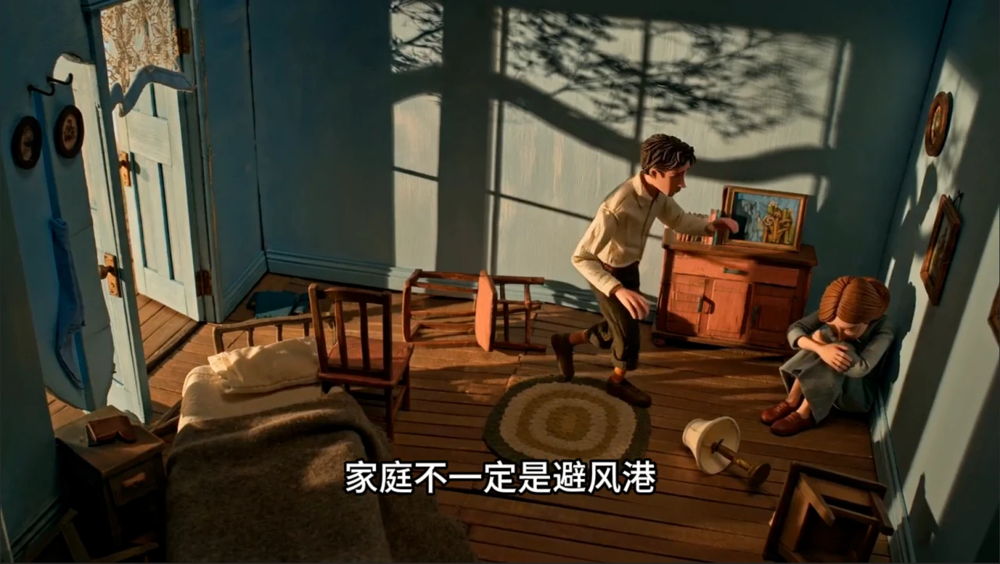
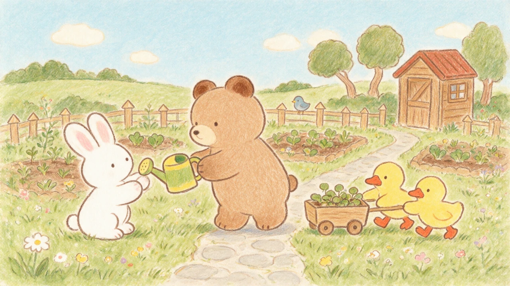
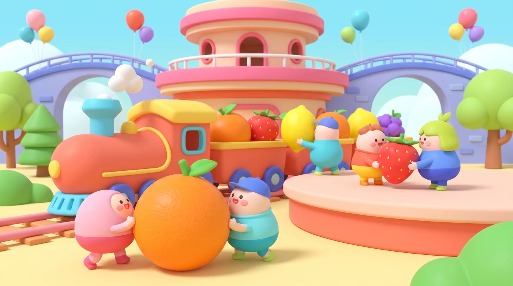

<h1 align="center">Animated Voiceover</h1>

  <a href="./README.md">English</a> · <strong>简体中文</strong>

  <strong>把故事、知识、报道与音乐，变成让人愿意看完的 AI 动画视频。</strong>

  

  
  
  

  <a href="#它能帮你做什么">核心能力</a> ·
  <a href="#视频效果参考">效果参考</a> ·
  <a href="#内置视觉风格">视觉风格</a> ·
  <a href="#安装">安装</a> ·
  <a href="#从一句话开始创作">开始创作</a>

`animated-voiceover` 将视频的内容模式与视觉风格分开。先选择制作 Mode，再选择由文字 Prompt 定义的 style、可复用音色和媒体 CLI。Skill 目前可以在 Storytime Animation、Animated Explainer、Animated Report 和 Music Video 之间路由，不会把一种题材的写作规则强套到另一种题材上。

Animated Explainer 和 Storytime Animation 都已经过实际生产验证。Storytime 已完成首支五片段英文作品；Animated Report 与 Music Video 目前先明确能力边界，端到端流程仍在扩充。

## 它能帮你做什么

- **选择正确的制作语法。** 根据视频的核心驱动力，使用第一人称故事、概念解释、证据型报道或音乐驱动的视觉结构。
- **把复杂知识讲清楚。** 从主题研究、内容取舍到旁白结构，帮助你建立一条观众听得懂、愿意继续听的叙事线。
- **把一篇讲稿变成可生成的动画方案。** 自动拆分叙事节奏，为每个片段设计多镜头调度，并输出可以直接进入 Seedance 制作的视频 Prompt。
- **让整支视频保持统一。** 通过文字 style、必要的人物参考与音色锚点，减少跨片段的人物漂移、画风跳变和声音不一致。
- **从创意一路走到可剪辑片段。** 不止交付文案，还能继续完成参考素材规划、片段生成和任务追踪，再把全部素材交给剪辑工具完成最终拼接与轻量修整。

## 视频效果参考

<table>
  <tr>
    <td width="50%">
      
    </td>
    <td width="50%">
      
    </td>
  </tr>
  <tr>
    <td align="center"><b>哲学科普</b>——让思想进入人物与故事</td>
    <td align="center"><b>心理科普</b>——用具体事件解释抽象概念</td>
  </tr>
</table>

## 内置视觉风格

Skill 内置七套经过整理的视觉语言，从电影感 3D、清爽白色圆身 Storytime 动画到手绘蜡笔动画均可直接选择。每套风格不仅描述“画面长什么样”，也包含它在人物造型、材质、色彩、镜头运动和动画节奏上的创作方法。

这些风格是创作起点，不是套模板。Skill 会围绕每一期的内容重新设计场景、人物与镜头；你也可以提供自己的文字风格说明。视觉 style 不依赖图片参考资产。

<table>
  <tr>
    <td width="50%" align="center">
       
      <b>电影感 3D 动画</b> 
      手绘质感、克制色彩与富有叙事感的电影光影 
      <a href="./styles/cinematic-3d-animation.md">查看风格详情</a>
    </td>
    <td width="50%" align="center">
       
      <b>黏土定格动画</b> 
      手工黏土偶、微缩布景与真实可触的逐帧质感 
      <a href="./styles/clay-stop-motion.md">查看风格详情</a>
    </td>
  </tr>
  <tr>
    <td width="50%" align="center">
       
      <b>忧郁蓝调简笔画</b> 
      冷灰蓝纸面、笨拙铅笔线与安静内省的情绪 
      <a href="./styles/melancholic-blue-simple-line-animation.md">查看风格详情</a>
    </td>
    <td width="50%" align="center">
       
      <b>柔和彩铅萌趣动画</b> 
      柔软轮廓、温暖纸纹与轻松亲切的可爱表达 
      <a href="./styles/soft-colored-pencil-cute-animation.md">查看风格详情</a>
    </td>
  </tr>
  <tr>
    <td width="50%" align="center">
       
      <b>清爽线描蜡笔动画</b> 
      明快色块、清楚线描与清爽有序的二维世界 
      <a href="./styles/clean-line-crayon-animation.md">查看风格详情</a>
    </td>
    <td width="50%" align="center">
       
      <b>多巴胺萌趣 3D 动画</b> 
      Q 弹角色、明亮配色与充满活力的画面层次 
      <a href="./styles/dopamine-cute-3d-animation.md">查看风格详情</a>
    </td>
  </tr>
</table>

共享风格库还包含[清爽白色圆身 Storytime 动画](./styles/clean-white-character-storytime-animation.md)：白色圆身二维人物、利落黑色粗线、有限平涂色块、清楚的喜剧表演，以及比人物更具体的环境。

## 不只是画风，还有可复用的声音

除了七套由文字 Prompt 定义的视觉风格，Skill 还随包提供多种标准化中文与英文音色。

你可以直接选用现成音色，也可以从第一个片段开始创造本期专属声音。Skill 会先与你确认选择，不会擅自替你决定风格或音色。

完整音色清单见[内置音色库](./references/reference-asset-library.md)。

## 已完成生产验证的工作流

Storytime Animation 增加第一人称故事采集、Storytime 专属[人物形象库](./modes/storytime-animation/characters/character-library.md)、对话式人物共创、讲述者表演，以及面向观众讲述与事件重现之间的灵活切换。Animated Explainer 则保留引入 Mode 架构前已经验证的原有工作流。

1. **确定讲什么。** 围绕主题、受众和时长研究资料，完成一篇结构清楚的旁白讲稿。
2. **确定长什么样。** 选择由文字 Prompt 定义的内置或自定义风格，并只为必须稳定辨认的人物建立参考图。
3. **把文字导演成画面。** 将讲稿拆成节奏均衡的片段，为每段设计具体事件、多镜头调度和可直接生成的视频 Prompt。
4. **先验证，再批量制作。** 先完成第一个片段，确认画面与声音方向，再锁定音色和必要人物参考，继续生成其余内容。
5. **在剪辑工具中收尾。** 下载全部生成片段后，由用户手动排序和拼接，轻量修剪边缘废帧、片尾极短声音毛刺，并检查节奏与切点。只有用户明确要求时才自动拼接。

目前经过实际验证的创作节奏是：将 1–5 分钟视频拆成 15 秒片段。Animated Explainer 通常以约 60 个汉字或约 32 个英文单词、约 5 镜为起点；英文 Storytime 以 30 个实际朗读单词为目标，通常保持 28–32 词，并使用 3–5 镜，约 4 镜是当前稳定起点。

## 安装

将本仓库克隆或复制到你的 Agent 可以读取的 skills 目录。

如果你使用 Codex，也可以直接告诉它：

> 从 `https://github.com/s1dashu/animated-voiceover` 安装 `$animated-voiceover` skill。

## 从一句话开始创作

安装后，你可以这样开始：

> 使用 `animated-voiceover` Skill 创作一支两分钟的动画科普视频，主题是：两分钟了解斯多葛主义。

也可以带上自己的要求：

> 使用 `animated-voiceover` Skill 把“为什么人会拖延”做成一支 90 秒心理科普动画。希望语气温柔，使用手绘风格，先和我确认讲稿与视觉方案。

Skill 会引导你完成必要选择，你不需要提前了解 Seedance Prompt、音色锚点或多模态素材连接方式。

## 工具与适用范围

当前正式维护并经过实际制作验证的媒体执行路径是 [LibTV CLI](https://libtv.ai/)。这套关于讲稿结构、视觉一致性、人物参考、多镜头导演和音色管理的方法并不依赖单一平台；在查阅目标平台的最新官方文档后，也可以适配 Higgsfield、即梦及其他支持多模态生成的 CLI。

目前的工作流主要针对由多个 15 秒片段组成的 1–5 分钟视频。Seedance 2.5 Pro 的 30 秒片段尚未完成系统性验证，因此没有被宣传为当前版本的默认能力。

想了解完整执行规则，可以阅读 [SKILL.md](./SKILL.md)。旁白、视频 Prompt、音色参考与封面制作方法分别收录在 [`references/`](./references/) 中。

## 许可证

本仓库的原创内容采用 [MIT License](./LICENSE) 开源。第三方文档和外部链接内容仍遵循各自权利人的许可条款。

  <strong>如果你也想把故事与观点做成更好看的动画，欢迎试用、分享，并为这个项目点一个 Star。</strong>

